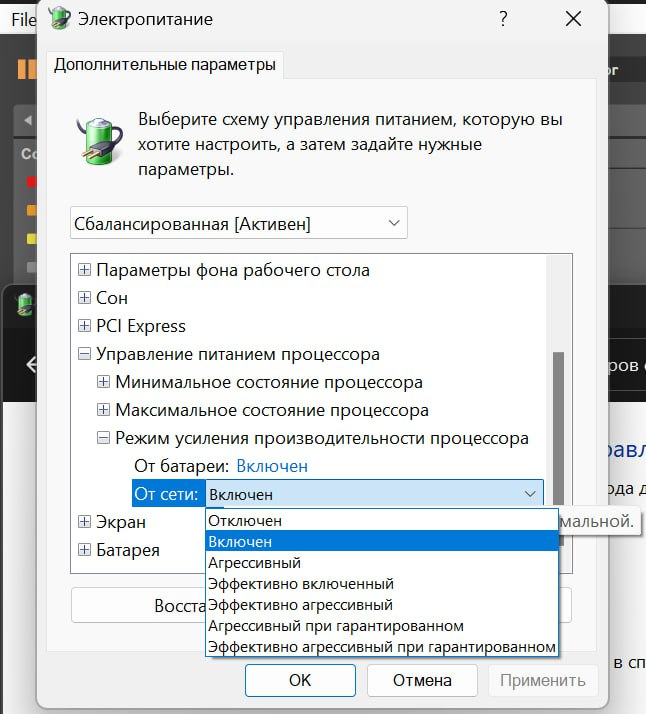

# Шпаргалка и FAQ по Xiaomi Redmibook Pro 14/16 2024 на Intel Ultra 125H/155H

- [Шпаргалка и FAQ по Xiaomi Redmibook Pro 14/16 2024 на Intel Ultra 125H/155H](#шпаргалка-и-faq-по-xiaomi-redmibook-pro-1416-2024-на-intel-ultra-125h155h)
  - [Полезные ссылки](#полезные-ссылки)
    - [Главное](#главное)
    - [Ревью](#ревью)
    - [Где купить](#где-купить)
      - [Ozon](#ozon)
    - [Разное](#разное)
  - [FaQ](#faq)
  - [Проверка на оригинальность](#проверка-на-оригинальность)
  - [Установка](#установка)
    - [Перед переустановкой Windows](#перед-переустановкой-windows)
    - [Установка Windows](#установка-windows)
      - [Драйверы](#драйверы)
    - [Установка Office](#установка-office)
    - [Установка Xiaomi PC Manager](#установка-xiaomi-pc-manager)
    - [Горячие клавиши](#горячие-клавиши)
  - [Настройка ПО](#настройка-по)
    - [Оптимизированная зарядка (до 80%)](#оптимизированная-зарядка-до-80)
    - [Цветовые профили](#цветовые-профили)
      - [От Xiaomi](#от-xiaomi)
      - [От Notebookcheck](#от-notebookcheck)
    - [Глубина цветности](#глубина-цветности)
    - [Параметры процессора](#параметры-процессора)

## Полезные ссылки

### Главное

- [Telegram чат](https://t.me/redmiclub1) владельцев RedmiBook Pro 14/16
- [Топик на 4pda](https://4pda.to/forum/index.php?showtopic=1085675)

### Ревью

- [Notebookcheck](https://www.notebookcheck-ru.com/Obzor-Xiaomi-RedmiBook-Pro-16-2024-Luchshii-noutbuk-na-Meteor-Lake-s-khoroshei-avtonomnostju.830060.0.html)

### Где купить

#### Ozon

- [Best choice](https://www.ozon.ru/seller/best-choice-244361/elektronika-15500/?miniapp=seller_244361) - [Ссылка на ноутбук](https://www.ozon.ru/product/xiaomi-16-noutbuk-redmi-redmi-book-pro16-2024-intel-core-ultra-5-125h-3-6-ggts-ram-32-gb-ssd-1024-1435692957/?asb=nSYjLnCEZr%252BDgDEO9AuM%252BRd%252Fqcp8Y%252Bdzp8pnK0bYYX0%253D), присылает не вскрытый, с пломбами
- [Технофаны](https://www.ozon.ru/seller/tehnofany-1285368/elektronika-15500/?miniapp=seller_1285368) - [Ссылка на ноутбук](https://www.ozon.ru/product/xiaomi-redmi-book-pro-14-2024-intel-core-ultra-5-noutbuk-125h-2-8k-14-displey-c-besplatnyy-podarok-1432468957/?asb=F%252F8L6mC4W%252B%252B8QnyKWhHkfm26KVstG31xoJvldS9Hcfw%253D), присылает вскрытый для переустановки Windows на русскую
- [Hizon](https://www.ozon.ru/seller/hizon-878210/ofisnaya-tehnika-15770/?miniapp=seller_878210) - Временно нет в магазине

### Разное

Страница с ПО на сайте Xiaomi <https://www.mi.com/service/notebook/drivers/N57> - Чтобы открыть нужно использовать VPN или [Croxy Proxy](https://www.croxyproxy.net/)

## FaQ

Экран матовый или глянцевый?
> Матовый

Тачпад стеклянный или пластиковый?
> Стеклянный

## Проверка на оригинальность

Вы можете [проверить на оф. сайте Xiaomi](https://www.mi.com/global/verify/#/ru/tab/imei) серийный номер ноутбука, чтобы удостовериться, что перед вами оригинал.

Предупреждение говорит о том, что купленный ноутбук не является глобальной версией, в моём случае - только для китайского рынка.

## Установка

### Перед переустановкой Windows

К ноутбуку привязана лицензия `Windows 11 Home` (многоязычная)
Перед переустановкой системы:

1. Перейдите в `Microsoft Store`
2. Войдите в учётную запись Microsoft
3. Перейдите в `библиотеку` и получите лицензию на `Office для дома и учёбы 2021`

### Установка Windows

Вход в BIOS - `F2` Boot меню - `F12`
При установке Windows удалите все разделы на диске.

❗Будьте готовы, что до установки драйверов тачпад и WiFi работать не будут: используйте внешнюю мышь и телефон в качестве модема через провод❗

#### Драйверы

1. Вы можете установить все драйверы с помощью **Центра обновлений Windows**
2. Или импортировать драйверы с помощью `pnputil`
   - Для этого [скачайте](https://drive.google.com/drive/folders/114d9uIPEyFlJO48S38-url-4raS7jj68) и распакуйте архив драйверов
   - Импортируйте драйверы: `pnputil /add-driver C:\drivers\*.inf /subdirs /install`

### Установка Office

[Скачайте автономный установщик](https://account.microsoft.com/services) в учётной записи Microsoft

### Установка Xiaomi PC Manager

- Для **первого** запуска программы нужно установить китайский **системным языком** (далее его можно удалить). Ждём пока все процессы скачивания и установки завершатся, после этого выходим из системы

- После выхода из системы заново входим: видим, что языком системы стал китайский - значит всё ок
- [Скачиваем](https://drive.google.com/drive/folders/114d9uIPEyFlJO48S38-url-4raS7jj68) и устанавливаем PC Manager (поставить галочку и далее нажимать на синие кнопки)
- Поздравляю, вы установили Xiaomi PC Manager!
- В настройках системы можете переключить язык обратно на русский

### Горячие клавиши

После установки PC Manager настроит горячие клавиши:

- `Fn + S` - переключение между доступными частотами обновления экрана: 48, 60 и 120/165 Гц (Отдельно в настройках системы можно включить динамическую частоту - 60 Гц или 120 Гц)

- `Fn + K` - переключение режимов производительности

- `F4` - отключить микрофон (на самой клавише будет гореть индикатор, если микрофон выключен)

- `F7` - быстрая настройка двух дисплеев
- `F8` - приложение Ножницы
- `F9` - настройки системы
- `F10` - управление подсветкой клавиатуры (выключить, половина яркости, полная яркость, авторежим)

- Дополнительная клавиша центра управления Xiaomi (можно назначить своё приложение или файл)

## Настройка ПО

### Оптимизированная зарядка (до 80%)

На момент написания, данная функция периодически отваливается, приходится выключать и включать заново

### Цветовые профили

#### От Xiaomi

#### От Notebookcheck

❗**Только для 16 дюймовой версии**

> Калиброванный профиль от Notebookcheck - просто великолепие. Один в один с моим AMOLED калиброванным iPhone
>
> — участник форума 4pda

1. [Скачайте](https://raw.githubusercontent.com/Data-Name-ID/RedmiBook-Pro-14-2024/main/files/Profile%20by%20Notebookcheck.icm) профиль от Notebookcheck
2. В поиске Windows найдите `Управление цветом`
3. В поле `Устройство` выберете `Экран 1`
4. Ниже, нажмите `Добавить` -> `Обзор` -> выберете скаченный профиль
5. Выберете появившийся профиль и нажмите `Сделать профилем по умолчанию`
6. Нажмите ниже на `Профили` -> выберете `Объединить мои параметры с системными значениями по умолчанию`

Отлично, но Google Chrome будет игнорировать данный профиль. Чтобы активировать его и в нём

1. Перейдите в [расширенные параметры браузера](chrome://flags/)
2. В поиске найдите `Forced Colors` -> выберете `Enable`
3. Перезапустите браузер

### Глубина цветности

Настройка наибольшей глубины цветности в [Центре управления графикой Intel](https://apps.microsoft.com/detail/9plfnlnt3g5g?hl=ru-ru) (`2^30` цветов вместо `2^24` по умолчанию):

### Параметры процессора

В силу особенностей процессора необходимо сменить режим турбобуста:

1. Нажмите Win+R и введите regedit
2. Найдите ключ `HKEY_LOCAL_MACHINE\SYSTEM\ControlSet001\Control\Power\PowerSettings\54533251-82be-4824-96c1-47b60b740d00\be337238-0d82-4146-a960-4f3749d470c7`
3. Измените параметр Attributes на 2
Теперь в настройках электропитания появится новый пункт. Переключаем его на `Включен`

